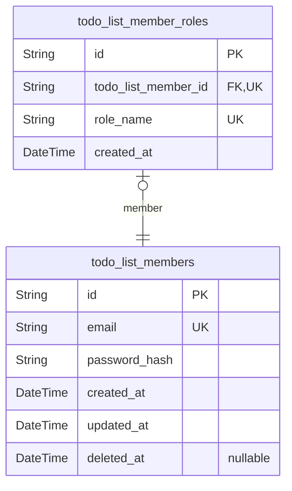
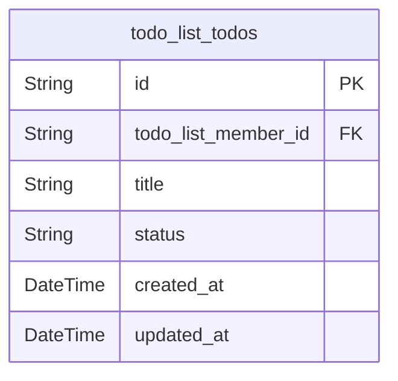

# Prisma Markdown

> Generated by [`prisma-markdown`](https://github.com/samchon/prisma-markdown)

- [Members](#members)
- [TodoItems](#todoitems)

## Members

### `todo_list_members`

Stores authentication credentials and identity information for todo list
users. Each member has a unique email and hashed password for secure
login.

Properties as follows:

- `id`: Primary Key.
- `email`
  > User's email address used for authentication. Must be unique across the
  > system.
- `password_hash`
  > Hashed password using bcrypt algorithm with cost factor 12. Never stores
  > plain text passwords.
- `created_at`: Timestamp when this user account was created.
- `updated_at`: Timestamp when this user account was last updated.
- `deleted_at`
  > Soft delete timestamp. If null, account is active; if set, account is
  > logically deleted.

### `todo_list_member_roles`

Defines the user roles available in the system. Currently only supports
'member' role. Each member is linked to exactly one role.

Properties as follows:

- `id`: Primary Key.
- `todo_list_member_id`: References the member who holds this role. [todo_list_members.id](#todo_list_members).
- `role_name`
  > The name of the role. Must be exactly 'member' as this system supports
  > only one role.
- `created_at`: Timestamp when this role assignment was created.

## TodoItems

### `todo_list_todos`

Todo items owned by members. Each todo represents a personal task that
can be toggled between active and completed states. This model is primary
as users directly manage these items independently through creation,
editing, status toggling, and deletion operations. References
todo_list_members to ensure data ownership. Never modified after
completion.

Properties as follows:

- `id`: Primary Key.
- `todo_list_member_id`: Owner of this todo item. [todo_list_members.id](#todo_list_members).
- `title`
  > The task title. Must be 1-255 characters, non-empty, non-whitespace only.
  > Preserves internal whitespace but trims leading/trailing spaces.
- `status`
  > Current state of the todo item. Must be exactly 'active' or 'completed'.
  > Newly created items have 'active' status. Title cannot be edited when
  > status is 'completed'.
- `created_at`
  > Timestamp when the todo item was created. Always set to current time in
  > Asia/Seoul timezone upon creation. Never modified.
- `updated_at`
  > Timestamp when the todo item was last modified (title updated or status
  > toggled). Always updated on changes. Not set on creation.
