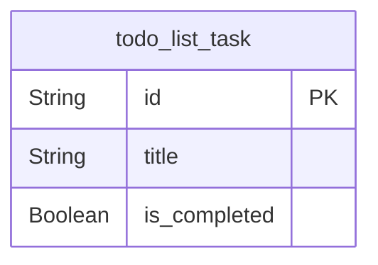

# Prisma Markdown

> Generated by [`prisma-markdown`](https://github.com/samchon/prisma-markdown)

- [Tasks](#tasks)

## Tasks

### `todo_list_task`

Stores individual todo tasks for a single-user application. Each task
contains a unique identifier, a text description of the task (up to 500
characters), and a completion status. This table has no relationships to
other entities, no timestamps, no user identifiers, no metadata, and no
audit fields. It is the sole persistent entity in the system. All
operations (create, read, update, delete) are performed against this
table using a simple client-side interface with no user authentication or
session management. Data persistence is local and device-bound.

Properties as follows:

- `id`: Primary Key.
- `title`
  > The text content of the task. Must contain at least one non-whitespace
  > character. Truncated to 500 characters if longer. Leading and trailing
  > whitespace is removed before storage. Preserves internal whitespace.
  > Case-sensitive.
- `is_completed`
  > The completion status of the task. true when the task has been marked as
  > completed (checked). false when the task is pending. No other values are
  > permitted. Default value is false.
