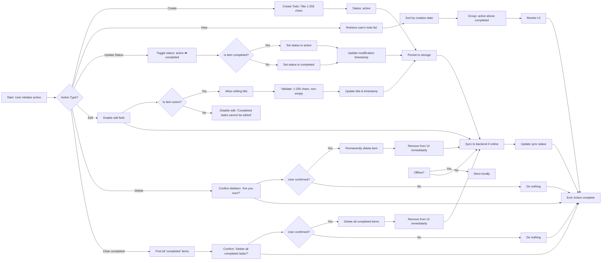

## Todo List Application - User Workflows

This document details the complete user workflows for managing todo items in the Todo List application. All workflows assume the user is authenticated as a "member" role with exclusive ownership of their todo data. This system is designed for personal task management only; no collaboration, sharing, or team features are supported.

### Create Todo Item

A user can create a new todo item by providing a title. This action adds the item to their personal todo list with an initial status of 'active'.

- WHEN a user submits a new todo item with a title, THE system SHALL create a new todo item in the user's personal collection.
- WHEN the user submits a todo item with an empty or whitespace-only title, THE system SHALL reject the request and display an error message: "Title cannot be empty."
- WHEN a user attempts to create a todo item with a title longer than 255 characters, THE system SHALL reject the request and display an error message: "Title must be 255 characters or fewer."
- THE system SHALL assign each new todo item a unique identifier (UUID).
- THE system SHALL set the todo item's status to 'active' upon creation.
- THE system SHALL set the creation timestamp to the current date and time in the user's timezone (Asia/Seoul).
- WE WHILE the user is creating a todo item, THE system SHALL maintain a responsive interface with immediate visual feedback.
- IF the device is offline when the user attempts to create a todo item, THE system SHALL store the item locally and synchronize it when connectivity returns.
- IF the user attempts to create a todo item while the system is experiencing a server error, THE system SHALL display: "Unable to save todo. Please try again."

### View Todo List

A user can view their complete collection of todo items, organized by status. The system displays all todo items owned by the authenticated user.

- WHEN a user accesses the todo list view, THE system SHALL retrieve all todo items belonging to the authenticated user.
- THE system SHALL display todo items sorted by creation timestamp, newest first.
- THE system SHALL group todo items by status: 'active' items appear above 'completed' items.
- WHILE the user is viewing the todo list, THE system SHALL maintain a response time under 1 second, even with hundreds of items.
- WHILE the user is viewing the todo list, THE system SHALL show a spinner or loading indicator while data is being retrieved.
- IF no todo items exist for the user, THE system SHALL display: "You have no todo items yet. Create your first task above."
- IF the device is offline, THE system SHALL display all todo items previously saved locally.
- IF the system encounters an error retrieving data, THE system SHALL display: "Unable to load your todo list. Please refresh or try again later."
- IF data is being synchronized in the background, THE system SHALL display: "Syncing changes..." in a non-intrusive banner.

### Update Todo Status

A user can toggle a todo item between 'active' and 'completed' states.

- WHEN a user clicks the checkbox next to an active todo item, THE system SHALL change that todo item's status to 'completed'.
- WHEN a user clicks the checkbox next to a completed todo item, THE system SHALL change that todo item's status to 'active'.
- WHEN a user attempts to update the status of a todo item, THE system SHALL validate that the item belongs to the authenticated user.
- WHEN a user updates a todo item's status, THE system SHALL update the modification timestamp to the current date and time (Asia/Seoul).
- THE system SHALL persist the status change immediately upon user interaction.
- IF the user updates a todo item's status while offline, THE system SHALL queue the change and apply it when connectivity is restored.
- IF a user attempts to update the status of a todo item that no longer exists, THE system SHALL display: "This task no longer exists. Please refresh your list."
- IF the system fails to update the status during synchronization, THE system SHALL revert the UI to the previous state and display: "Failed to update task status. Please try again."

### Edit Todo Item

A user can edit the title of a todo item until the item has been marked as completed.

- WHEN a user clicks the edit button on an active todo item, THE system SHALL enable an editable text field with the current title pre-filled.
- WHEN a user submits an edited title, THE system SHALL validate the new title: 1 to 255 characters, non-empty, non-whitespace only.
- WHEN a user attempts to edit a completed todo item, THE system SHALL disable the edit function and display: "Completed tasks cannot be edited. Create a new task."
- WHEN a user edits a todo item title and saves the change, THE system SHALL update the item's title and modification timestamp.
- WHEN a user cancels editing without saving, THE system SHALL discard changes and return to the original state.
- WHEN a user submits an edited title exceeding 255 characters, THE system SHALL revert the UI and display: "Title must be 255 characters or fewer."
- WHEN a user submits an empty or whitespace-only title during editing, THE system SHALL revert the UI and display: "Title cannot be empty."
- IF the device is offline during editing, THE system SHALL store changes locally and synchronize after reconnecting.
- IF the edit operation fails due to a server error, THE system SHALL show: "Unable to save changes. Try again."

### Delete Todo Item

A user can permanently remove a todo item from their list.

- WHEN a user clicks the delete button on any todo item (active or completed), THE system SHALL initiate deletion confirmation.
- WHEN a user confirms deletion, THE system SHALL permanently remove the todo item from the user's personal collection.
- THE system SHALL NOT allow recovery of deleted items.
- WHEN a todo item is deleted, THE system SHALL update the user interface to immediately remove that item from the list.
- IF a user attempts to delete an item while offline, THE system SHALL queue the deletion and execute it upon reconnection.
- IF a user attempts to delete a todo item that no longer exists, THE system SHALL display: "This task no longer exists."
- IF the system fails to delete the item due to a server error, THE system SHALL display: "Unable to delete task. Please try again."
- IF a user attempts to delete multiple items concurrently, THE system SHALL process each deletion sequentially and update the UI after each successful deletion.

### Clear Completed Items

A user can remove all completed todo items from their list in a single action.

- WHEN a user clicks the "Clear completed" button, THE system SHALL display a confirmation dialog: "Are you sure you want to delete all completed tasks? This cannot be undone."
- WHEN a user confirms clearing completed items, THE system SHALL permanently delete all todo items with status 'completed'.
- THE system SHALL leave all active todo items unaffected.
- WHEN completed items are cleared, THE system SHALL instantly update the user interface to remove them from view.
- IF a user attempts to clear completed items while offline, THE system SHALL queue the operation and execute it when connectivity returns.
- IF the system fails to clear completed items due to a server error, THE system SHALL display: "Failed to clear completed items. Please try again."
- IF no completed items exist when the user clicks "Clear completed", THE system SHALL display: "No completed tasks to clear." and take no action.

### Identity And Data Ownership

- THE system SHALL ensure that every todo item is exclusively owned by the authenticated user.
- THE system SHALL NEVER display or allow access to another user's todo items.
- THE system SHALL ensure that user actions (create, update, delete) apply only to the user's own data.
- THE system SHALL validate ownership on every request that modifies a todo item.
- THE system SHALL reject any attempted access to todo items with mismatched authentication tokens.
- THE system SHALL store user data locally on the device and never transmit it to external servers or services.

### Edge Case Handling

- IF a user performs multiple actions in quick succession (e.g., delete then immediately recreate an item with the same title), THE system SHALL treat each action independently with unique identifiers.
- IF a user reactivates a completed task, THE system SHALL preserve the original creation timestamp and only update the modification timestamp.
- IF the system is updated to a new version, THE system SHALL continue to serve existing user data without migration or data loss.
- IF the application crashes during an unsaved action, THE system SHALL restore all locally stored data upon restart.
- IF the device's clock is inaccurate, THE system SHALL use UTC timestamps internally and display times adjusted to Asia/Seoul based on device timezone settings.
- IF the system receives data from a future date, THE system SHALL accept the data but maintain server time as authoritative for sorting and validation.

### System Behavior Summary

- All actions must respond within 1 second for a responsive user experience.
- No data is ever lost due to application crashes, battery drain, or network interruptions.
- User data is stored exclusively on the user's device and never transmitted externally.
- Error messages are user-friendly, clear, and provide actionable paths for recovery.
- All todo item modifications are persisted immediately after user interaction.
- There are no time-based auto-deletions, auto-completions, or periodic data cleanups.
- The system is designed for single-user personal task management only.

### Mermaid Diagram: Todo Item Lifecycle

### Business Rules Reference

All workflows operate under the following business rules defined in 03-business-rules.md:

- Todo item title must be between 1 and 255 characters
- Todo item title cannot be empty or contain only whitespace
- Todo item status must be one of: 'active' or 'completed'
- Each todo item must have a unique identifier
- Changes must be persisted immediately after user action
- No concurrent editing of the same item from multiple devices

### Non-functional Requirements Reference

All workflows adhere to the following non-functional requirements defined in 04-non-functional.md:

- All operations must respond within 1 second
- Offline changes must be synchronized when connection returns
- Data must never be lost due to application crash or battery drain
- User interface must show clear feedback for all actions
- Application must be usable on any modern web browser or device
- No user data is transmitted to any external server or service

> *Developer Note: This document defines **business requirements only**. All technical implementations (architecture, APIs, database design, etc.) are at the discretion of the development team.*