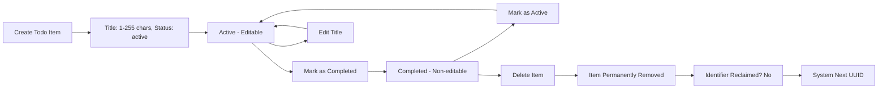

## Business Rules for Todo List Application

This document defines the core business rules and constraints that govern the behavior of todo items in the system. These rules ensure data integrity, user control, and consistent system behavior. All implementation must strictly enforce these rules.

### Todo Item Properties

Every todo item must have the following properties:

- A unique identifier (UUID)
- A title (text)
- A status (active or completed)
- A creation timestamp (ISO 8601 format)
- An optional last updated timestamp (ISO 8601 format)

The system must store and maintain these properties for every todo item. No additional properties are permitted.

### Title Requirements

The title of a todo item is the primary content and must adhere to the following rules:

- THE title SHALL be between 1 and 255 characters in length.
- THE title SHALL not be empty (must contain at least one non-whitespace character).
- THE title SHALL not consist solely of whitespace characters (spaces, tabs, line breaks).
- THE system SHALL normalize leading and trailing whitespace when storing the title, but preserve internal whitespace.
- THE system SHALL reject any title that violates these requirements with a clear error message to the user.
- WHEN a user attempts to create a todo item with an invalid title, THE system SHALL NOT create the item and SHALL display the reason for rejection.

### Status Validation Rules

Todo items can only exist in one of two states, and transitions between states are strictly controlled:

- THE status SHALL only accept one of two values: "active" or "completed".
- WHEN a new todo item is created, THE system SHALL set the status to "active" by default.
- WHEN a user marks a todo item as completed, THE system SHALL change the status from "active" to "completed".
- WHEN a user marks a todo item as active, THE system SHALL change the status from "completed" to "active".
- WHILE the status is "completed", THE system SHALL NOT allow the title to be modified.
- WHILE the status is "active", THE system SHALL permit title editing.
- IF a request is made to set the status to any value other than "active" or "completed", THEN THE system SHALL reject the request and maintain the current status.

### Persistence Rules

Data integrity is critical. Todo items must persist reliably under all expected conditions:

- WHEN a user creates, updates, or deletes a todo item, THE system SHALL persist the change immediately to local storage.
- WHILE the application is running, THE system SHALL maintain an in-memory representation of todo items that exactly matches the persisted state.
- IF the application crashes or the device loses power, THE system SHALL restore all todo items accurately from local storage when reopened.
- THE system SHALL guarantee that no todo item is lost due to unexpected cessation of the application.
- WHERE a user has an internet connection, THE system SHALL allow backup of todo items to cloud storage, but SHALL NOT require cloud sync for core functionality.
- WHERE no internet connection is available, THE system SHALL continue to operate fully and sync changes when connectivity returns.

### Concurrency Rules

This is a personal todo list application with no collaborative features. Concurrency is limited to single-device use:

- THE system SHALL NOT support simultaneous editing of the same todo item from multiple devices or browsers.
- WHERE a user attempts to modify a todo item on a second device while it is still open on the first device, THE system SHALL NOT automatically merge changes.
- IF a todo item is modified on one device and then modified again on another device after synchronization, THE system SHALL treat the second modification as a new update and overwrite the previous version.
- THE system SHALL NOT lock todo items or block users from editing due to concurrent access.
- WHEN a user performs an action on a todo item and then reconnects to sync with another device, THE system SHALL respect the most recently saved version.

### Identification and Tracking

Each todo item must be uniquely identifiable and traceable:

- THE system SHALL assign a universally unique identifier (UUID version 4) to each todo item upon creation.
- THE unique identifier SHALL NOT be editable by the user and SHALL remain fixed for the lifetime of the todo item.
- WHEN a todo item is deleted, THE system SHALL remove it from storage and shall not reuse its identifier for any future item.
- THE system SHALL maintain a complete audit history of changes for each todo item (creation, update, deletion) for diagnostic purposes, but SHALL NOT expose this history to the user.

### Error Handling

System behavior during invalid operations must be user-friendly and deterministic:

- IF a user attempts to create a todo item with a title shorter than 1 character, THEN THE system SHALL display an error message: "Todo title cannot be empty. Please enter a title of 1 to 255 characters."
- IF a user attempts to create a todo item with a title longer than 255 characters, THEN THE system SHALL display an error message: "Todo title is too long. Please limit to 255 characters or fewer."
- IF a user attempts to set the status to any value other than "active" or "completed", THEN THE system SHALL display an error message: "Invalid status. Status must be 'active' or 'completed'."
- IF a user attempts to edit the title of a completed todo item, THEN THE system SHALL prevent editing and display a message: "You cannot edit completed tasks. Either mark the task as active first, or delete it and create a new one."
- IF a user attempts to delete a todo item that does not exist, THEN THE system SHALL do nothing and return a success response (no error shown).
- IF a user attempts to update a todo item with an invalid UUID, THEN THE system SHALL return an error: "Invalid todo item. Item does not exist or has been deleted."

### Data Privacy and Ownership

The integrity and privacy of user data are paramount:

- THE system SHALL ensure that all todo items belong exclusively to the authenticated user.
- THE system SHALL NEVER store or access todo items from a different user account.
- THE system SHALL NOT transmit any todo item data to external servers unless the user manually initiates a backup.
- THE system SHALL use local encrypted storage on the device to protect todo item data.
- WHERE backup is enabled, THE system SHALL encrypt todo data before transmission and decrypt upon retrieval.
- NO third-party service SHALL have access to todo item data, regardless of connection state.

### State Life Cycle

Todo items follow a clear, predictable life cycle:

The life cycle confirms that:

- Creation requires a valid title
- Editing is only permitted while active
- Completion removes edit ability
- Deletion is permanent and irreversible
- Identifiers are never reused

This lifecycle shall be fully implemented in software and cannot be extended or modified without explicit business approval.

### Historical Context and Value

Even though the user has requested a minimal feature set, these rules exist to prevent common failures found in other todo applications:

- Unlike paper lists, this system prevents accidental deletion and supports undo through status toggling
- Unlike other digital apps, this system ensures no data loss on crashes due to immediate persistence
- Unlike collaborative apps, this system avoids merge conflicts by not supporting simultaneous changes

By implementing these rules, the todo list becomes a reliable, trustworthy tool that the user can depend on daily.

> *Developer Note: This document defines **business requirements only**. All technical implementations (architecture, APIs, database design, etc.) are at the discretion of the development team.*